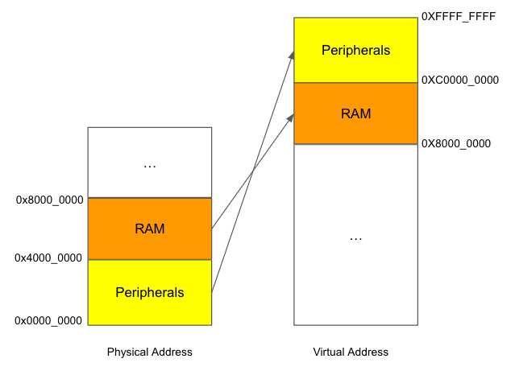
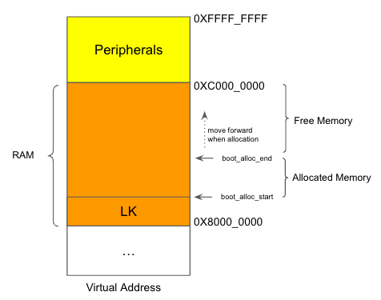
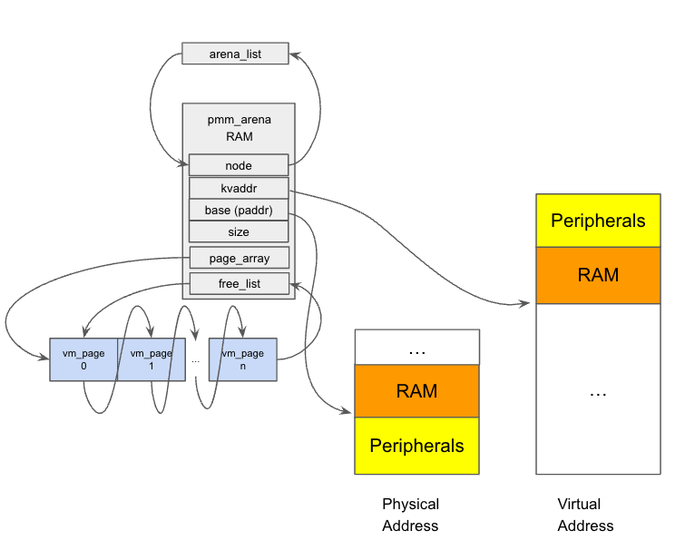
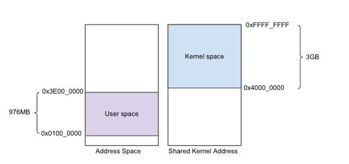
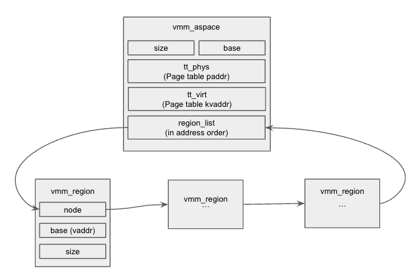
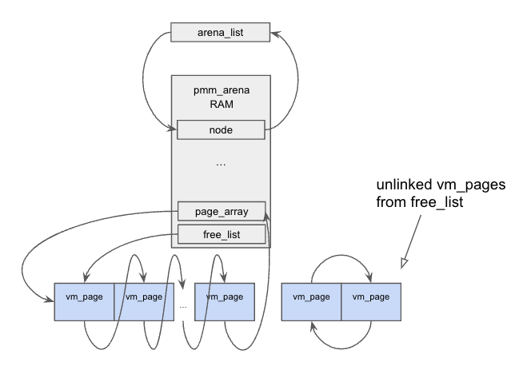
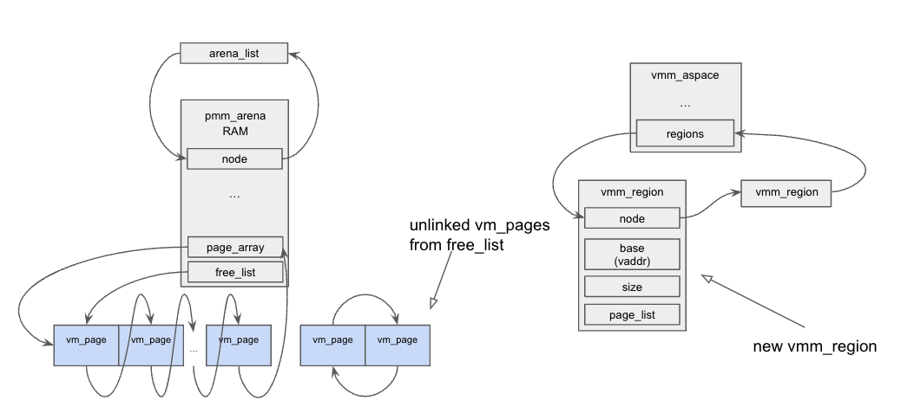
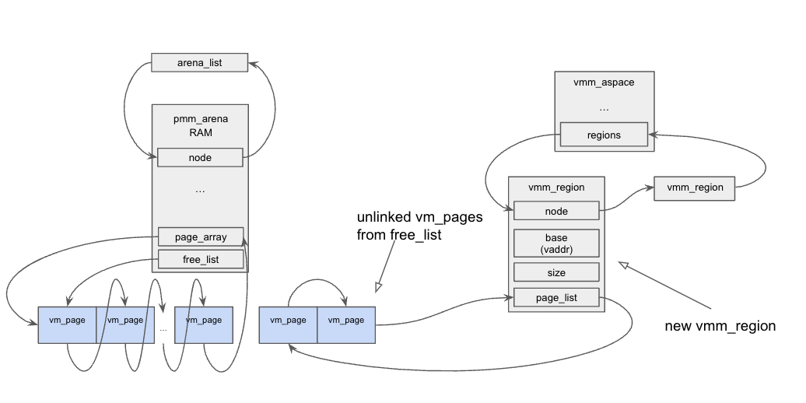

# LK Memory Management Overview

# Abstract

This article discusses the memory management system of the LK OS.

First, we look at the initial memory mapping and allocator without VMM, and see how LK use them to sets up the virtual memory system.

Then, the article explains the data structures LK uses to manage physical pages and virtual addresses.

At the end, we show how LK uses these structures for page mapping.

# Initial mapping

Upon reset, LK will do the initial mapping according global variable mmu_initial_mapping. For ARM, the related code can be found at [arch/arm/arm/start.S#L137](https://github.com/littlekernel/lk/blob/7102838b49ef19bda9301968f04634bacd6d6d7a/arch/arm/arm/start.S#L137)

mmu_initial_mapping layout depends on platform. Take qemu-virt-arm as an example. It is in [platform/qemu-virt-arm/platform.c](https://github.com/littlekernel/lk/blob/7102838b49ef19bda9301968f04634bacd6d6d7a/platform/qemu-virt-arm/platform.c#L36). The following demonstrate the layout. 



Initial Memory Mapping

In LK, the term 'paddr' is used for referring physical memory addresses. After this initial mapping, the virtual addresses are referred to as 'kvaddr'. A one-to-one mapping always exists between 'paddr' and 'kvaddr'. The function 'paddr_to_kvaddr' is used to carry out this translation.

```c
// kernel/vm/vm.c
void *paddr_to_kvaddr(paddr_t pa) {
    struct mmu_initial_mapping *map = mmu_initial_mappings;
    while (map->size > 0) {
        if (!(map->flags & MMU_INITIAL_MAPPING_TEMPORARY) &&
                pa >= map->phys &&
                pa <= map->phys + map->size - 1) {
            return (void *)(map->virt + (pa - map->phys));
        }
        map++;
    }
    return NULL;
}
```

LK also uses the term 'vaddr'. This stands for the virtual address that is mapped by the virtual memory management — the real deal VMM. 'vaddr' is very flexible - the address could either be in the kernel space or the user space. The address can also change its mapping to different physical memories as needed. 'kvaddr' is always a 'vaddr', but it's important to note that not all 'vaddr' are 'kvaddr'. We'll go into more detail on this as we delve deeper into memory management.

# Boot allocator

qemu loads LK kernel at the beginning of the RAM.

After initial mapping, but before the memory management gets set up, LK uses a boot allocator to allocate memory from the RAM. This allocator is simple and has two pointers - "boot_alloc_start" and "boot_alloc_end". Both pointers point to the end of LK kernel code at the beginning. When more memory is needed, the allocator returns the value of "boot_alloc_end" and moves it forward. The value of "boot_alloc_start" stays the same.



LK kernel && Boot allocator

The related code can be found at [kernel/vm/bootalloc.c](https://github.com/littlekernel/lk/blob/7102838b49ef19bda9301968f04634bacd6d6d7a/kernel/vm/bootalloc.c#L27)

```c
extern int _end;
uintptr_t boot_alloc_start = (uintptr_t) &_end;
uintptr_t boot_alloc_end = (uintptr_t) &_end;
void *boot_alloc_mem(size_t len) {
    ...
    ptr = ALIGN(boot_alloc_end, 8);
    boot_alloc_end = (ptr + ALIGN(len, 8));
    ...
    return (void *)ptr;
}
```

“_end” is a link script variable that points to the end of kernel code. The link script is [arch/arm/system-onesegment.ld](https://github.com/littlekernel/lk/blob/7102838b49ef19bda9301968f04634bacd6d6d7a/arch/arm/system-onesegment.ld#L111)

```c
ENTRY(_start)
SECTIONS
{
    . = %KERNEL_BASE% + %KERNEL_LOAD_OFFSET%;
    _start = .;
    ...
    _end = .;
}
```

“KERNEL_BASE” is 0x8000_0000, “KERNEL_LOAD_OFFSET” is not defined, default to 0.

```c
// arch/arm/rules.mk
...
KERNEL_BASE ?= 0x80000000
KERNEL_LOAD_OFFSET ?= 0
...
```

# Physical Memory (pmm_arena)

With the initial mapping and boot allocator, qemu-virt-arm’s platform code will sets up the structure for managing physical memory.

LK uses a structure named 'pmm_arena' for a continuous chunk of physical memory. In our case, qemu-virt-arm only use one 'pmm_arena'  to describe the whole RAM block. This structure includes basic information like size, paddr (called base), and kvaddr of the physical memory (check the Initial Mapping section if you need to remember what these mean). All 'pmm_arena' structures are put into a global linked list head ‘arena_list’. Although in qemu-virt-arm, there is only on pmm_arena.

In LK, memory is managed at the page’s granularity, where each page is 4KB. The 'pmm_arena' structure includes a pointer to a 'vm_page' array. Each element in the array corresponds to one page in the 'pmm_arena'.

Once the 'pmm_arena' is initialized, all 'vm_page' items are linked to the 'free_list' in the 'pmm_arena'. This means the Virtual Memory Manager (VMM) hasn't allocated these pages yet. We'll go deeper into the VMM and this field later on.



pmm_arena

Function 'pmm_add_arena’ is used to initialize 'pmm_arena’ structure. This happens when qemu-virt-arm setup mmu.

```c
platform/qemu-virt-arm/platform.c
void platform_early_init(void) {
    ...
    /* add the main memory arena */
    pmm_add_arena(&arena);
    ...
}
```

Here's one thing we should note. After the 'pmm_arena' is set up, all the pages are linked to the 'free_list'. However, not all the pages in the RAM are really free. For example, the LK’s code are located at the start of the RAM and 'pmm_arena’ itself also occupied some RAM (allocated by boot allocator). To tackle this issue, LK will adjusts the 'free_list' after finishing VMM setup. 

The code that adjusts the 'free_list' is located in the 'vm_init_preheap()' function.

```c
static void vm_init_preheap(uint level) {
    vmm_init_preheap();  // <-- Init VMM

    // Remove LK code's RAM from free_list
    mark_pages_in_use((vaddr_t)&_start, ((uintptr_t)&_end - (uintptr_t)&_start));

    // Remove the RAM allocated via boot allocator from free_list
    if (boot_alloc_end != boot_alloc_start) {
        mark_pages_in_use(boot_alloc_start, boot_alloc_end - boot_alloc_start);
    }
}
```

# Virtual Address (aspace)

In LK, similar to many system, a process contains two separate virtual address spaces. One is the kernel address space, it is shared by all processes. Processes will use kernel address space when handling system calls. The other one is the user address space. User address space isn’t shared. Each process has its own user address space. All of the memory management structures are managed in the kernel address space. The initial mapping we talked about earlier is also in the kernel address space.



Address Space

It's worth noting that, unlike some other kernels, the kernel space in LK doesn’t contains user space mapping. It means the kernel code can’t access user space memory directly.

The ranges for both the kernel and user address spaces are defined at:

```c
// arch/arm/rules.mk
...
KERNEL_ASPACE_BASE=0x40000000
KERNEL_ASPACE_SIZE=0xc0000000

// kernel/include/kernel/vm.h
...
#ifndef USER_ASPACE_BASE
#define USER_ASPACE_BASE ((vaddr_t)0x01000000UL)
#endif
#ifndef USER_ASPACE_SIZE
#define USER_ASPACE_SIZE ((vaddr_t)KERNEL_ASPACE_BASE - USER_ASPACE_BASE - 0x01000000UL)
#endif
```

LK uses a structure known as 'vmm_aspace' to represent an address space. There's a globally shared 'vmm_aspace' that describes the kernel space, and each process  has its own private 'vmm_aspace' for the user space.

The 'vmm_aspace' structure contains information about the base of the virtual address region (in our case, it's 0x0100_0000 for user space and 0x4000_0000 for kernel space), the size of the region, and most importantly, the 'paddr' and 'kvaddr' of the ARM page table associated with this 'aspace'. When a user space application is running, the page table in its private 'aspace'  is used. When a system call is processed, the page table in the shared kernel’s 'aspace' is used. 

'aspace' contains a region_list. The list tracks which parts of the virtual address space are reserved or already in use. Each used or reserved virtual address region is represented by a 'vmm_region' structure. This structure contains the region’s base address and how big it is. 'vmm_region' is ordered by the base address. These addresses are called 'vaddr' (remember we mentioned that 'vaddr' includes 'kvaddr' in the Initial Mapping section?).



There's one more thing that is need mentioned. The kernel aspace range spans from 0x4000_0000 to 0xFFFF_FFFF. This range contains the initial virtual space layout created during initial mapping (0x8000_0000 to 0xC000_0000 for RAM, and 0xC000_0000 to 0xFFFF_FFFF for periperal). So LK needs to tell kernel aspace that these virtual spaces are already in used. This is accomplished by calling the function vmm_reserve_space after kernel aspace is initialized.

```c
// kernel/vm/vm.c
static void vm_init_postheap(uint level) {
    vmm_init();   // <-- Init VMM (including kernel aspacew)

    /* create vmm regions to cover what is already there from the initial mapping table */
    struct mmu_initial_mapping *map = mmu_initial_mappings;
    while (map->size > 0) {
        if (!(map->flags & MMU_INITIAL_MAPPING_TEMPORARY)) {
            vmm_reserve_space(vmm_get_kernel_aspace(), map->name, map->size, map->virt);
        }
        map++;
    }
}
```

In the function vmm_reserve_space, LK creates a vmm_region, inserts it into region_list. More importantly, the function also updates the page table (pointed by tt_virt / tt_phys) to tell the processor that these pages are reserved.

# Physical to virtual mapping

Up to this point, we've discussed how LK manages physical memory (via the 'pmm_arena' structures) and how it manages virtual addresses (through the 'vmm_aspace' structures). However, these concepts become truly useful when we are able to map a physical memory to a virtual address. 

To allocate a chunk of memory that is accessible via virtual address space, the first step is to find enough unallocated physical pages. It can be done by searching pmm_arena’s free_list and unlink vm_page from the list. 



unlink vm_page from free_list

Notes that even though the 'vm_page's are unlinked from the 'pmm_arena's 'free_list', the 'pmm_arena' doesn’t lose the reference to the 'vm_page'. Because the 'vm_page's are part of the 'page_array', and the 'pmm_arena' still hold the pointer to 'page_array'.

In the picture above, the allocated 'vm_page's are consecutive. This isn't a requirement - it's just shown this way for simplicity. In practice, it's possible that the 'vm_page's are scattered around or even come from different 'pmm_arena's (although qemu-virt-arm only has one pmm_arena).

The pmm_alloc_pages function searches the free_list and unlinks the vm_page from it.

```c
// kernel/vm/pmm.c
size_t pmm_alloc_pages(uint count, struct list_node *list) {
    ...
    /* walk the arenas in order, allocating as many pages as we can from each */
    pmm_arena_t *a;
    list_for_every_entry(&arena_list, a, pmm_arena_t, node) {
        while (allocated < count && a->free_count > 0) {
            vm_page_t *page = list_remove_head_type(&a->free_list, vm_page_t, node);
            ...
            list_add_tail(list, &page->node);
            allocated++;
        }
    }
    ...
    return allocated;
}
```

Now that the physical pages are ready, the next step is to allocate a virtual address region to map them. As mentioned in the “Virtual Address (aspace)” section earlier, a process's virtual address is managed by vmm_aspace. A allocated virtual address region is a vmm_region within vmm_aspace. Allocating a virtual address region involves searching through the vmm_aspace’s regions linked list, finding a large enough gap, creating a new vmm_region describing the gap, and inserting vmm_region into regions linked list.



new vmm_region

Please note that the vmm_region is sorted based on their base vaddr. In the illustration, the new vmm_region is depicted as the first element for clarity. However, in actual practice, the new vmm_region might not always be the first element. 

The process of finding a gap, creating a vmm_region, and inserting it into the regions linked list can be accomplished using the alloc_region function.

```c
kernel/vm/vmm.c

static vmm_region_t *alloc_region(vmm_aspace_t *aspace, const char *name, size_t size,
                                  vaddr_t vaddr, uint8_t align_pow2,
                                  uint vmm_flags, uint region_flags, uint arch_mmu_flags) {
    // create vmm_region
    vmm_region_t *r = alloc_region_struct(name, vaddr, size, region_flags, arch_mmu_flags);
    ...
        // Find a gap in vmm_aspace
        struct list_node *before = NULL;
        vaddr = alloc_spot(aspace, size, align_pow2, arch_mmu_flags, &before);
        ...

        // Insert vmm_region into vmm_aspace.regions
        r->base = (vaddr_t)vaddr;
        list_add_after(before, &r->node);
    }

    return r;
}
```

We now have the physical vm_pages and the vmm_region. The final step is to map the vm_page to the vmm_region. To achieve this, we must update the page table. The vmm_aspace contains a pointer to the page table (as referenced in the “Virtual Address (aspace)” section above). In addition to updating the page table, LK will also link the vm_pages to the vmm_region’s page_list linked list. 

To handle all the aforementioned tasks, including allocating physical pages, setting up the virtual address region, and actual mapping, LK uses the vmm_alloc function.

```c
// kernel/vm/vmm.c
status_t vmm_alloc(vmm_aspace_t *aspace, const char *name, size_t size, void **ptr,
                   uint8_t align_pow2, uint vmm_flags, uint arch_mmu_flags) {
    ...
    // Allocate physical pages
    struct list_node page_list;
    list_initialize(&page_list);
    size_t count = pmm_alloc_pages(size / PAGE_SIZE, &page_list);
    ...
    // Allocate virtual address region
    vmm_region_t *r = alloc_region(aspace, name, size, vaddr, align_pow2, vmm_flags,
                                   VMM_REGION_FLAG_PHYSICAL, arch_mmu_flags);
    ...
    // 1. Link vm_page to vmm_region.page_list
    // 2. Update page table
    vm_page_t *p;
    vaddr_t va = r->base;
    while ((p = list_remove_head_type(&page_list, vm_page_t, node))) {
        paddr_t pa = vm_page_to_paddr(p);
        // Update page table
        err = arch_mmu_map(&aspace->arch_aspace, va, pa, 1, arch_mmu_flags);
        // Link vm_page to vmm_region.page_
        list_add_tail(&r->page_list, &p->node);
        va += PAGE_SIZE;
    }
    ...
}
```

After the mapping is complete, the resulting graph looks as follows



Physical Memory Mapping
